<!--
README - Lucas Antunes
GitHub Profile
-->

# 🧑‍💻 Lucas Antunes

### Backend • Automação • CI/CD • Dados • Machine Learning

Formado em **Análise e Desenvolvimento de Sistemas**, com foco em
**desenvolvimento backend, automação, CI/CD e soluções orientadas a dados**.

Tenho foco em **análise, ciência e arquitetura de dados**, com ênfase em
**Machine Learning**, buscando desenvolver APIs, pipelines, integrações e
sistemas limpos, confiáveis e escaláveis.

---

## 🚀 Tecnologias e Ferramentas

### 🧱 Backend & APIs

#### API REST • Node.js • Express • Java • Spring Boot • Python • Flask

  
  
  
  
  
  

  
  

---

### 🎨 Frontend & Interfaces

  
  
  
  
  

  
  
  
  
  

---

### 🗄️ Bancos de Dados • Persistência

  
  
  
  

---

### 🧠 Dados & Machine Learning

#### Analytics & Data

##### Jupyter • Google Colab • Power BI • Pandas • NumPy • Matplotlib

  
  
  
  
  
  

#### Machine Learning & Computer Vision

##### scikit-learn • PyTorch • OpenCV • ONNX

  
  
  
  

---

### ⚙️ DevOps, CI/CD & Infraestrutura

#### DevOps • Containers • CI/CD • Linux • Git • Nginx

  
  
  
  
  

  
  

---

## ⭐ Projetos em Destaque

<table>
  <tr>
    <td width="50%" valign="top">
      <h3 align="center">
        <a href="https://github.com/lusc451/Geo-Pandas">🗺️ Geo-Pandas</a>
      </h3>
      

        Projeto voltado à manipulação, transformação e análise de dados
        georreferenciados, explorando processos de ETL, geometria e
        visualização de dados espaciais por meio de notebooks Python.
      

      

        <b>Python • Jupyter • Pandas • GeoPandas • Shapely</b>
      

    </td>
    <td width="50%" valign="top">
      <h3 align="center">
        <a href="https://github.com/lusc451/retail-vision-age">🤖 Retail Vision AI</a>
      </h3>
      

        Solução de visão computacional com detecção e rastreamento de pessoas,
        estimativa de idade, backend para inferência e pipeline dedicado ao
        treinamento e exportação de modelos de Machine Learning.
      

      

        <b>Python • Flask • OpenCV • PyTorch • YOLO • ONNX • MongoDB</b>
      

    </td>
  </tr>
</table>

---

## 🎓 Formação

- 🎓 <b>Análise e Desenvolvimento de Sistemas</b> — Fatec Franca
- 📘 <b>Técnico em Informática</b> — Etec Prof. Alcídio de Souza Prado
- 🔧 <b>Técnico em Eletroeletrônica</b> — Etec Pedro Badran

---

## 📊 Estatísticas do GitHub

  
  

---

## 🌐 Contatos & Redes Sociais

  
  
  
  

---

## 🐍 Snake Animation

<picture>
  <source
    media="(prefers-color-scheme: dark)"
    srcset="./profile/github-contribution-grid-snake-dark.svg"
  />
  <source
    media="(prefers-color-scheme: light)"
    srcset="./profile/github-contribution-grid-snake.svg"
  />
  
</picture>

